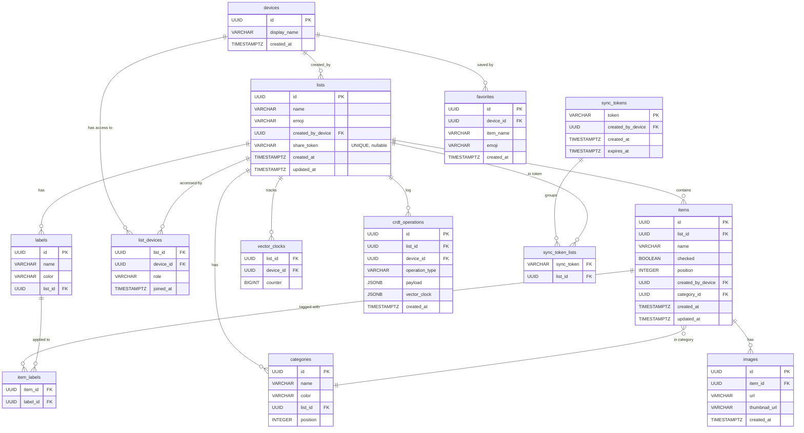

# ListMe — Developer Guide

> **Audience:** Every developer joining the project.
> **Goal:** After reading this, you should be able to open any file in the repo and immediately understand why it exists and how it connects to everything else.

Before reading this guide, read [architecture.md](architecture.md) — it covers the three core concepts (device identity, offline-first, CRDTs + vector clocks) that everything else builds on.

---

## Table of Contents

1. [Tech Stack](#1-tech-stack)
2. [Dev Environment Setup](#2-dev-environment-setup)
3. [Codebase Map](#3-codebase-map)
4. [Database Schema](#4-database-schema)
5. [API Reference](#5-api-reference)
6. [Data Flow Walkthroughs](#6-data-flow-walkthroughs)
7. [Implementation Phases](#7-implementation-phases)
8. [Testing](#8-testing)
9. [AI Guidelines](#9-ai-guidelines)
10. [Sources & References](#10-sources--references)

---

## 1. Tech Stack

### Backend

| Technology                  | Version   | Purpose                        |
| --------------------------- | --------- | ------------------------------ |
| Java                        | 17        | Language                       |
| Spring Boot                 | 4.0.2     | Application framework          |
| Spring WebSocket + STOMP    | (bundled) | Real-time messaging            |
| Spring Data JPA + Hibernate | (bundled) | ORM / database access          |
| PostgreSQL                  | 16        | Persistence                    |
| Flyway                      | (bundled) | Database migrations            |
| Lombok                      | latest    | Boilerplate reduction          |
| TestContainers              | latest    | Integration tests with real DB |
| Maven                       | 3.9       | Build tool                     |

### Frontend

| Technology                | Version | Purpose                        |
| ------------------------- | ------- | ------------------------------ |
| Vue 3                     | 3.5     | UI framework (Composition API) |
| TypeScript                | 5.9     | Type safety                    |
| Vite                      | 7       | Build tool + dev server        |
| Pinia                     | 3       | State management               |
| Vue Router                | 4       | Client-side routing            |
| Axios                     | latest  | HTTP client                    |
| STOMP.js                  | latest  | WebSocket/STOMP client         |
| Dexie                     | 4       | IndexedDB wrapper              |
| Yjs                       | latest  | CRDT library (future use)      |
| Tailwind CSS              | 4       | Utility-first styling          |
| Catppuccin Frappe         | —       | Design system / colour palette |
| vite-plugin-pwa (Workbox) | latest  | Service Worker + PWA manifest  |
| Vitest                    | 4       | Unit testing                   |
| Inter                     | —       | Typography                     |

### Infrastructure

| Technology              | Purpose                |
| ----------------------- | ---------------------- |
| Docker + Docker Compose | Local dev environment  |
| PostgreSQL 16 (Docker)  | Local database         |
| AWS Lightsail           | Production hosting     |
| Terraform               | Infrastructure as code |
| GitHub Actions          | CI/CD                  |
| CloudFront + S3         | CDN + image storage    |

---

## 2. Dev Environment Setup

### Prerequisites

- Docker Desktop installed and running
- Git

### Start everything

```bash
git clone <repo> && cd listme
docker compose up
```

That's it. Docker Compose starts three containers:

| Service    | URL                   | What it does                         |
| ---------- | --------------------- | ------------------------------------ |
| Frontend   | http://localhost:5173 | Vue dev server with Vite HMR         |
| Backend    | http://localhost:8080 | Spring Boot with live logs           |
| PostgreSQL | localhost:5432        | Database (persists in Docker volume) |

Source code is volume-mounted, so:

- **Frontend:** edits hot-reload instantly via Vite HMR
- **Backend:** requires `docker compose restart backend` after Java changes (Maven recompiles)

### Database access

```bash
docker exec -it listme-db psql -U listme -d listme
```

### View backend logs

```bash
docker compose logs -f backend
```

### Running frontend tests

```bash
cd listme-frontend
npm install
npm run test        # Vitest (unit)
npm run test:e2e    # Playwright (when configured)
```

### Running backend tests

```bash
cd listme-backend
./mvnw test         # Requires Docker (TestContainers spins up PostgreSQL)
```

### Troubleshooting

**Port already in use:**

Port 8080 (backend) and 5173 (frontend) are configured in `docker-compose.yml`. If another process is using them:

```bash
# Windows
netstat -ano | findstr :8080

# macOS / Linux
netstat -tulpn | grep :8080
```

Or change the host port in `docker-compose.yml` (e.g., `"8081:8080"`).

**Searching logs for errors:**

```bash
docker compose logs backend | grep -i error
docker compose logs backend | grep "NullPointerException"
```

**Backend won't start (DB not ready):**

Docker Compose already waits for PostgreSQL's healthcheck before starting the backend. If it still crashes:

```bash
docker compose restart backend
```

**npm errors / node_modules corruption:**

```bash
docker compose down -v   # removes volumes including cached node_modules
docker compose up        # reinstalls from scratch
```

**Database in a bad state (schema drift, failed migration):**

```bash
docker compose down -v   # wipes the postgres volume
docker compose up        # Flyway runs all migrations fresh
```

---

## 3. Codebase Map

### Backend — `listme-backend/src/main/java/com/oliwier/listmebackend/`

```
api/                          ← HTTP controllers + DTOs
│
├── ListController.java        CRUD for shopping lists
├── ItemController.java        CRUD for items + toggle-check
├── DeviceController.java      GET /devices/me (device info)
├── ShareController.java       Share token generation + join
├── SyncTokenController.java   Cross-device sync token
├── CategoryController.java    CRUD for per-list categories
├── SyncController.java        CRDT pull/push endpoints
│
└── dto/
    ├── CrdtOperationResponse  What the server broadcasts (includes deviceId)
    ├── ItemResponse           Item as seen by the client
    └── ...

crdt/                         ← Core CRDT logic (no Spring dependencies)
│
├── VectorClock.java           Immutable vector clock (increment, merge, compare)
├── SyncEngine.java            Records ops, applies incoming, catchup queries
├── ConflictDetector.java      Finds CONCURRENT op pairs (for conflict UI)
├── IncomingOperation.java     DTO for ops pushed from client → server
└── OperationType.java         Enum: ITEM_CREATE, ITEM_UPDATE, ITEM_CHECK, ...

domain/
│
├── model/                    ← JPA entities (one per DB table)
│   ├── Device.java
│   ├── ShoppingList.java
│   ├── Item.java
│   ├── Category.java
│   ├── CrdtOperation.java     The operation log entry
│   ├── VectorClockEntry.java  Per-(list, device) counter
│   └── SyncToken.java
│
├── repository/               ← Spring Data repositories
│   ├── ItemRepository.java
│   ├── CrdtOperationRepository.java
│   └── ...
│
└── service/                  ← Business logic
    ├── ItemService.java       Mutations → records CRDT ops → broadcasts
    ├── ShareService.java      Token generation (12-char random)
    ├── SyncTokenService.java  Token generation (24-char, 30-day expiry)
    └── CategoryService.java

websocket/                    ← STOMP infrastructure
│
├── WebSocketConfig.java       Enables STOMP, /ws/websocket endpoint
├── DeviceHandshakeInterceptor Extracts deviceId from ?deviceId= query param
├── SyncMessageHandler.java    Handles /app/list/{id}/join|leave
├── ListSyncBroadcaster.java   convertAndSend to /topic/list/{id}
└── PresenceTracker.java       In-memory ConcurrentHashMap of online devices

identity/
├── CurrentDevice.java         @CurrentDevice annotation
└── DeviceArgumentResolver     Resolves annotation → auto-creates Device row

config/
└── (WebSocket, CORS, Security configs)
```

### Frontend — `listme-frontend/src/`

```
views/                        ← Full-page components (one per route)
│
├── HomeView.vue               List of all your lists with FAB + AddListModal
└── ListDetailView.vue         Single list with items, presence, ConnectionBanner

components/
│
├── common/
│   ├── AppHeader.vue          Glassmorphism top bar
│   ├── BottomNav.vue          iOS-style bottom navigation
│   ├── FloatingActionButton   Pulse-animated FAB
│   ├── AddListModal.vue       Bottom sheet: name + emoji picker
│   └── ConnectionBanner.vue   Offline / syncing / connected strip
│
├── list/
│   ├── ListCard.vue           Progress bar + participant count card
│   └── ListSection.vue        Section header ("Geteilt mit mir" etc.)
│
└── item/
    ├── ItemRow.vue            Checkbox + name + edit/delete swipe actions
    └── AddItemSheet.vue       Bottom sheet: add or edit an item

stores/                       ← Pinia stores (reactive global state)
│
├── lists.ts                   All shopping lists; cache-first fetch
├── items.ts                   Items per list; offline write path + queue
└── presence.ts                Online device counts per list

services/                     ← Pure logic, no Vue reactivity
│
├── api.ts                     Axios instance; injects X-Device-Id header
├── device.ts                  getDeviceId() → IndexedDB singleton
├── list.ts                    HTTP calls for list CRUD
├── item.ts                    HTTP calls for item CRUD
├── websocket.ts               STOMP.js client (connect, subscribe, send)
├── db.ts                      Dexie schema (lists, items, localClocks tables)
├── cache.ts                   CacheService — read/write IndexedDB
└── clock.ts                   LocalClockService — per-list clock counter

composables/                  ← Vue composition utilities
│
├── useOffline.ts              Module-level isOnline ref (window online/offline)
├── useListSync.ts             WebSocket lifecycle for one list view
└── useSyncQueue.ts            Watches isOnline, flushes OperationQueue on reconnect

crdt/                         ← Frontend CRDT logic (mirrors backend)
│
├── types.ts                   CrdtOperation, OperationType, VectorClockMap
├── VectorClock.ts             Same logic as backend VectorClock.java
├── ConflictDetector.ts        Finds concurrent op pairs (for future conflict UI)
└── OperationQueue.ts          IndexedDB-backed queue for offline ops

router/index.ts               /  → HomeView, /list/:id → ListDetailView
```

---

## 4. Database Schema



### Key design decisions

- **`crdt_operations` is append-only.** Operations are stored with their `payload` and `vector_clock` as JSONB. The `items` table is a _materialised view_ derived from replaying these operations. Never delete from `crdt_operations` (except for pruning very old synced ops).
- **`vector_clocks` is a live counter table.** One row per `(list_id, device_id)` pair. `SyncEngine.record()` increments this before snapshotting.
- **IDs are UUIDs everywhere.** This allows clients to generate IDs offline without coordination.
- **`list_devices` controls access.** Every API endpoint checks `listDeviceRepository.existsByListIdAndDeviceId()`. No row = no access.

---

## 5. API Reference

### Device Identity

| Method | Path              | Description             |
| ------ | ----------------- | ----------------------- |
| `GET`  | `/api/devices/me` | Get current device info |

All endpoints read `X-Device-Id` header and auto-create the device if new.

### Lists

| Method   | Path              | Description                             |
| -------- | ----------------- | --------------------------------------- |
| `GET`    | `/api/lists`      | All lists for this device               |
| `POST`   | `/api/lists`      | Create list `{ name, emoji? }`          |
| `GET`    | `/api/lists/{id}` | Get single list                         |
| `PUT`    | `/api/lists/{id}` | Update `{ name, emoji }`                |
| `DELETE` | `/api/lists/{id}` | Leave list (hard-delete if last member) |

### Items

| Method   | Path                                   | Description                         |
| -------- | -------------------------------------- | ----------------------------------- |
| `GET`    | `/api/lists/{id}/items`                | All items (ordered by position)     |
| `POST`   | `/api/lists/{id}/items`                | Create item `{ name, categoryId? }` |
| `PUT`    | `/api/lists/{id}/items/{itemId}`       | Update item                         |
| `PATCH`  | `/api/lists/{id}/items/{itemId}/check` | Toggle checked                      |
| `DELETE` | `/api/lists/{id}/items/{itemId}`       | Delete item                         |

Each write also: records a `CrdtOperation`, broadcasts it over WebSocket.

### Sharing

| Method   | Path                      | Description                            |
| -------- | ------------------------- | -------------------------------------- |
| `POST`   | `/api/lists/{id}/share`   | Generate share token                   |
| `DELETE` | `/api/lists/{id}/share`   | Revoke share token                     |
| `GET`    | `/api/share/{token}`      | Preview shared list (no auth required) |
| `POST`   | `/api/share/{token}/join` | Join list with token                   |

### Cross-Device Sync

| Method | Path                      | Description                                   |
| ------ | ------------------------- | --------------------------------------------- |
| `POST` | `/api/sync`               | Create sync token (groups all device's lists) |
| `GET`  | `/api/sync/{token}`       | Preview all lists in token                    |
| `POST` | `/api/sync/{token}/apply` | Import all lists to current device            |

### CRDT Sync

| Method | Path                                     | Description                   |
| ------ | ---------------------------------------- | ----------------------------- |
| `GET`  | `/api/lists/{id}/crdt/clock`             | Server's current vector clock |
| `GET`  | `/api/lists/{id}/crdt/ops?since={clock}` | Ops client hasn't seen        |
| `POST` | `/api/lists/{id}/crdt/ops`               | Push offline ops from client  |

### WebSocket Destinations

| Destination                 | Direction | Payload                 |
| --------------------------- | --------- | ----------------------- |
| `/app/list/{id}/join`       | C → S     | (none)                  |
| `/app/list/{id}/leave`      | C → S     | (none)                  |
| `/topic/list/{id}`          | S → C     | `CrdtOperationResponse` |
| `/topic/list/{id}/presence` | S → C     | `PresenceMessage`       |

---

## 6. Data Flow Walkthroughs

### Scenario A: Adding an item (online, single device)

```
1. User types "Milk" and taps Add
2. AddItemSheet emits @submit("Milk")
3. ListDetailView.handleItemSubmit() → itemsStore.create(listId, { name: "Milk" })
4. itemsStore.create() → itemService.create() → POST /api/lists/{id}/items
5. Backend:
     a. DeviceArgumentResolver → auto-registers device if new
     b. ItemService.create() → saves Item to DB
     c. SyncEngine.record() → increments vector_clocks, saves CrdtOperation
     d. ListSyncBroadcaster.broadcastOp() → STOMP /topic/list/{id}
     e. Returns 201 { id, name, checked: false, position, ... }
6. itemsStore.create() receives response → pushes to itemsByList[listId]
7. CacheService.saveItem() → writes to IndexedDB
8. ListDetailView re-renders with new item (Vue reactivity)
```

### Scenario B: Adding an item (offline)

```
1-3. Same as above
4. itemsStore.create() → itemService.create() → POST ... → AxiosError (no response)
5. isNetworkError(e) === true → offline path:
     a. itemId = crypto.randomUUID()   ← client assigns ID
     b. Build Item object              ← same shape as server would return
     c. Push to Pinia store            ← UI shows item immediately
     d. CacheService.saveItem()        ← survives page refresh
     e. LocalClockService.getNextClock() → { [deviceId]: counter++ } (persisted to IDB)
     f. OperationQueue.enqueue(ITEM_CREATE op)   ← queue in IDB
6. User sees item. No error shown. App works normally.
```

### Scenario C: Reconnecting after offline

```
1. window fires 'online' event
2. useOffline isOnline ref → true
3. useSyncQueue watches isOnline → calls flushQueue()
4. flushQueue():
     a. OperationQueue.getAllPending() → [op1, op2, ...]
     b. Group by listId
     c. POST /api/lists/{id}/crdt/ops [op1, op2, ...]
     d. SyncEngine.applyIncoming():
          - existsById(op.id)? → skip (idempotent)
          - case ITEM_CREATE → itemRepository.existsById(itemId)? skip : create
          - mergeIncomingClock() → update vector_clocks
     e. OperationQueue.markAllSynced(opIds)
     f. OperationQueue.pruneOld()
5. itemsStore.fetchAll(listId) for each affected list → reconcile with server
```

### Scenario D: Two users edit simultaneously (split-brain)

```
Device A (offline): renames item "Milk" → "Organic Milk"  at t=100
Device B (offline): renames item "Milk" → "Whole Milk"    at t=101
Both reconnect:

1. A pushes op: { type: ITEM_UPDATE, name: "Organic Milk", timestamp: 100 }
   Server applies: item.name = "Organic Milk"

2. B pushes op: { type: ITEM_UPDATE, name: "Whole Milk", timestamp: 101 }
   SyncEngine.applyEffect():
     incomingTs=101 >= localTs=100 → update wins
   Server applies: item.name = "Whole Milk"

3. After fetchAll(), both devices show "Whole Milk"

4. ConflictDetector finds A's op and B's op are CONCURRENT
   (A's clock {A:1,B:0} vs B's clock {A:0,B:1} → CONCURRENT)
   → This pair is flagged for future conflict UI (Phase 6)
```

---

## 7. Implementation Phases

### Phase 6 — Sharing & Conflicts UI

**Backend is ready.** Everything below is frontend work.

#### 6.1 Share link modal

Create `components/list/ShareListModal.vue`. It should:

1. Call `POST /api/lists/{id}/share` and receive `{ shareToken }`
2. Build the share URL: `window.location.origin + '/s/' + shareToken`
3. Show the URL with a copy-to-clipboard button
4. Show a "Revoke" button that calls `DELETE /api/lists/{id}/share`

Add a route `/s/:token` → new `views/JoinListView.vue` that:

1. Calls `GET /api/share/:token` to preview the list name/emoji
2. Shows a "Join List" button that calls `POST /api/share/:token/join`
3. On success, navigates to `/list/:id`

#### 6.2 Cross-device sync modal

Create `components/list/LinkDevicesModal.vue`. It should:

1. Call `POST /api/sync` to get a sync token
2. Display it as text + optionally a QR code (use a library like `qrcode`)
3. Add route `/sync/:token` → `views/SyncApplyView.vue` that calls `POST /api/sync/:token/apply`

#### 6.3 Conflict banner

`ConflictDetector.ts` already finds conflicting op pairs. Wire it up:

1. After `fetchAll()` or after the WebSocket `applyOp` path, run `ConflictDetector.detectConflicts()`
2. If conflicts exist, show `ConnectionBanner` variant or a new `ConflictBanner.vue`
3. Show both values side-by-side. A "Dismiss" button calls `OperationQueue.pruneOld()`

#### 6.4 Participant list

Create `components/list/ParticipantList.vue`:

- Call `GET /api/lists/{id}` (participantCount is already in the response)
- Full participant list needs a new endpoint — add `GET /api/lists/{id}/participants` that returns `list_devices` rows

---

### Phase 7 — Enhanced Features

#### 7.1 Labels

The DB schema exists (`labels`, `item_labels`). You need:

- **Backend:** `LabelController` + `LabelService` (follow the pattern of `CategoryController`)
- **Frontend:** `LabelTag.vue` (pill-shaped chip), `LabelManager.vue` (manage per-list labels), wire into `AddItemSheet`

#### 7.2 Search

- **Backend:** Add `GET /api/lists/{id}/items?q={query}` — `ItemRepository.findByListIdAndNameContainingIgnoreCase()`
- **Frontend:** `SearchBar.vue` in `ListDetailView` header, debounce input, filter `itemsStore.getItems()` client-side first (instant), fall back to API for server search

#### 7.3 Favorites (quick-add)

The `favorites` table exists. You need:

- **Backend:** `FavoriteController` — `GET /api/favorites`, `POST /api/favorites`, `DELETE /api/favorites/{id}`
- **Frontend:** Show recent favorites in `AddItemSheet` as quick-tap chips

#### 7.4 Duplicate list

- **Backend:** Add `POST /api/lists/{id}/duplicate` in `ListController` → `ListService.duplicate()` creates a new list + copies all items
- **Frontend:** Long-press on `ListCard` → context menu with "Duplicate" option

---

### Phase 8 — Images & Budget

#### 8.1 Image upload

- **Infrastructure:** Terraform S3 bucket + CloudFront distribution
- **Backend:** `ImageController` with presigned URL generation (`POST /api/lists/{id}/items/{itemId}/image/upload-url`), `ImageService` using AWS SDK
- **Frontend:** `ItemImageUpload.vue` — file input or camera capture, upload directly to presigned URL, save URL via `PATCH /api/lists/{id}/items/{itemId}`

#### 8.2 Prices & budget

- **Backend:** Add `price DECIMAL(10,2)` column to `items` (new Flyway migration V5), `BudgetController` with `GET /api/lists/{id}/budget` returning sum
- **Frontend:** `ItemPrice.vue` (inline input on `ItemRow`), `BudgetView.vue` showing total estimated / remaining

---

### Phase 9 — UX Polish

#### 9.1 Dark mode

Catppuccin has a `Latte` (light) variant alongside `Frappe` (dark). Add a Pinia `theme` store:

```ts
const theme = ref<"frappe" | "latte">(
  (localStorage.getItem("theme") as "frappe" | "latte") ?? "frappe",
);
```

Toggle the `data-theme` attribute on `document.documentElement`. Persist to `localStorage`.

#### 9.2 Export

- **Backend:** Add `GET /api/lists/{id}/export?format=csv` and `?format=pdf`
  - CSV: use Apache Commons CSV
  - PDF: use iText or OpenPDF
- **Frontend:** "Export" menu option on list detail page, triggers download

---

### Phase 12 — Production Prep

#### Infrastructure checklist

```bash
# Provision with Terraform
cd infrastructure/terraform
terraform init
terraform plan
terraform apply

# Build production images
docker build -t listme-backend:prod ./listme-backend
docker build -t listme-frontend:prod ./listme-frontend
```

#### Security checklist (before going live)

- [ ] Rate limiting: 100 req/min per IP (use Bucket4j or Spring Cloud Gateway)
- [ ] CORS: whitelist only `https://listme.app` in `WebSocketConfig` and `SecurityConfig`
- [ ] Share tokens: verify minimum 12 chars (currently: `SecureRandom`, 12 chars → 72 bits entropy ✓)
- [ ] Sync tokens: minimum 24 chars (currently: 24 chars → 144 bits entropy ✓)
- [ ] CSP headers: add `Content-Security-Policy` via Spring Security
- [ ] HTTPS everywhere: Lightsail + CloudFront enforce TLS
- [ ] Input validation: `@Valid` on all request bodies (already in place)
- [ ] Dependency audit: `./mvnw dependency-check:check` + `npm audit`

---

## 8. Testing

### 8.1 Backend — Framework Overview

The backend uses three layers of testing, all run with `./mvnw test`:

| Layer | Framework | What it tests |
|-------|-----------|---------------|
| **Unit** | JUnit 5 + AssertJ | Pure Java logic with no I/O (VectorClock math, CRDT properties) |
| **Integration** | JUnit 5 + Spring MockMvc + TestContainers | Full HTTP request → DB round-trips with a real PostgreSQL container |
| **WebSocket** | JUnit 5 + Spring `WebSocketStompClient` | Live STOMP message delivery over a random port |

---

### 8.2 Backend — TestContainers Boilerplate

Every integration test class follows the same pattern. Copy-paste this when adding a new one:

```java
@SpringBootTest
@AutoConfigureMockMvc
@Testcontainers
@TestMethodOrder(MethodOrderer.OrderAnnotation.class)   // use @Order on each test
class MyNewFeatureTest {

    // Starts one postgres container per class, shared across all @Test methods
    @Container
    static PostgreSQLContainer<?> postgres = new PostgreSQLContainer<>("postgres:16-alpine");

    // Injects the container's dynamic port/credentials into Spring before context starts
    @DynamicPropertySource
    static void configureProperties(DynamicPropertyRegistry registry) {
        registry.add("spring.datasource.url", postgres::getJdbcUrl);
        registry.add("spring.datasource.username", postgres::getUsername);
        registry.add("spring.datasource.password", postgres::getPassword);
    }

    @Autowired MockMvc mvc;
    @Autowired JsonMapper mapper;

    static final String DEVICE_A = UUID.randomUUID().toString();  // random per test run
    static String listId;   // populated by an early @Order test, shared across later ones
}
```

**Making requests** — always include the device header:

```java
mvc.perform(post("/api/lists")
        .header("X-Device-Id", DEVICE_A)
        .contentType(MediaType.APPLICATION_JSON)
        .content(mapper.writeValueAsString(Map.of("name", "Test", "emoji", "🧪"))))
    .andExpect(status().isCreated())
    .andExpect(jsonPath("$.name").value("Test"));
```

---

### 8.3 Backend — Existing Test Files

#### `Phase1IntegrationTest.java`
Tests device identity, list CRUD, share tokens, and sync tokens in order:

| `@Order` | Test | Asserts |
|----------|------|---------|
| 1 | `deviceAutoRegisters` | `GET /devices/me` auto-creates device, returns its UUID |
| 2 | `rejectsMissingDeviceHeader` | Missing `X-Device-Id` → 400 |
| 10 | `createList` | 201 response, `participantCount=1`, captures `listId` |
| 11 | `getMyLists` | Device A sees exactly 1 list |
| 20–23 | Share token flow | Generate token → preview → Device B joins → Device B sees list |
| 30–32 | Sync token flow | Create token → preview → Device C applies → Device C sees list |

#### `Phase2IntegrationTest.java`
Full CRUD for lists, categories, and items:

| `@Order` | Test | Asserts |
|----------|------|---------|
| 10–13 | List CRUD | Create, get, update; non-participant gets 403 |
| 20–22 | Category CRUD | Create with color, update, get |
| 30–36 | Item CRUD | Create with category, position increments, toggle check twice, update clears category, delete |
| 40 | List deletion | DELETE removes self from participants; device sees 0 lists |

#### `Phase3CrdtTest.java`

**Pure unit tests (no DB, `@Order` 1–8):**

```java
@Test @Order(3)
void vectorClock_compare_before() {
    VectorClock older = VectorClock.of(Map.of("A", 1L, "B", 2L));
    VectorClock newer = VectorClock.of(Map.of("A", 3L, "B", 4L));
    assertThat(older.compare(newer)).isEqualTo(VectorClock.Relation.BEFORE);
    assertThat(newer.compare(older)).isEqualTo(VectorClock.Relation.AFTER);
}

@Test @Order(7)
void vectorClock_merge_commutative() {
    // merge(A, B) == merge(B, A)
    VectorClock ab = a.merge(b);
    VectorClock ba = b.merge(a);
    assertThat(ab.get("dev-A")).isEqualTo(ba.get("dev-A"));
}
```

**Integration tests (`@Order` 20–26):**

| `@Order` | Test | Asserts |
|----------|------|---------|
| 20 | `setup_listAndItem` | Creates list + item, captures IDs |
| 21 | `clockIncrements_afterItemCreate` | Vector clock counter for Device A = 1 |
| 22 | `opsRecorded_forItemCreate` | `GET /crdt/ops` returns 1 op of type `ITEM_CREATE` |
| 23 | `clockIncrements_afterToggleCheck` | Clock counter = 2 after second op |
| 24 | `deviceB_seesOpsAfterJoining` | Device B joins via share token, gets 2 ops from catchup |
| 25 | `pushOp_fromDeviceB_appliedToServer` | `POST /crdt/ops` with offline CHECK op → item state updated |
| 26 | `pushOp_idempotent_duplicateIgnored` | Pushing same op UUID twice → op count stays the same |

#### `Phase4IntegrationTest.java`

Tests live WebSocket delivery using `WebSocketStompClient` with a `RANDOM_PORT` server:

```java
@SpringBootTest(webEnvironment = RANDOM_PORT)  // ← needed for real WebSocket
```

| `@Order` | Test | Asserts |
|----------|------|---------|
| 10 | `setup` | Creates list + shares with Device B |
| 20 | `itemCreate_broadcastsToSubscribers` | Device B's WS receives `ITEM_CREATE` op with correct `itemId` |
| 21 | `itemCheck_broadcastsToSubscribers` | Device B's WS receives `ITEM_CHECK` op |
| 22 | `presence_joinBroadcastedToOthers` | Device A's presence subscription receives `{ event: "joined", deviceId: B }` |

---

### 8.4 Backend — Adding New Tests

**Rule:** one test class per feature area, tests ordered with `@Order` so they share state (e.g., a list created in `@Order(10)` is used by `@Order(20)`).

When you implement a new phase, add a corresponding `Phase5OfflineTest.java`, etc. Cover:
1. The happy path (online operation works)
2. Access control (non-participant gets 403)
3. Any CRDT-specific behaviour (idempotency, clock increments)

---

### 8.5 Frontend — Framework Overview

The frontend uses Vitest with `happy-dom` as the DOM environment. Config is in [vitest.config.ts](../listme-frontend/vitest.config.ts):

```ts
export default defineConfig({
  plugins: [vue()],
  test: {
    environment: 'happy-dom',   // lightweight DOM — faster than jsdom
    include: [
      'src/**/*.{test,spec}.{ts,tsx}',
      'tests/**/*.{test,spec}.{ts,tsx}',
    ],
  },
})
```

Run tests:

```bash
cd listme-frontend
npm run test          # watch mode
npm run test -- --run # CI / single pass
```

---

### 8.6 Frontend — What to Test

#### CRDT classes (`src/crdt/`)

```ts
// src/crdt/VectorClock.spec.ts
import { describe, it, expect } from 'vitest'
import { VectorClock } from './VectorClock'

describe('VectorClock', () => {
  it('increments own counter', () => {
    const vc = new VectorClock({})
    const next = vc.increment('device-A')
    expect(next.get('device-A')).toBe(1)
    expect(vc.get('device-A')).toBe(0)   // original unchanged (immutable)
  })

  it('detects concurrent ops', () => {
    const a = new VectorClock({ A: 2, B: 1 })
    const b = new VectorClock({ A: 1, B: 2 })
    expect(a.compare(b)).toBe('CONCURRENT')
    expect(b.compare(a)).toBe('CONCURRENT')
  })

  it('merge is commutative', () => {
    const a = new VectorClock({ A: 5, B: 1 })
    const b = new VectorClock({ A: 2, B: 8 })
    expect(a.merge(b).toMap()).toEqual(b.merge(a).toMap())
  })
})
```

#### OperationQueue (`src/crdt/OperationQueue.ts`)

Needs `fake-indexeddb` because Dexie uses IndexedDB:

```bash
npm install -D fake-indexeddb
```

```ts
// src/crdt/OperationQueue.spec.ts
import 'fake-indexeddb/auto'
import { describe, it, expect, beforeEach } from 'vitest'
import { OperationQueue } from './OperationQueue'

beforeEach(async () => {
  await OperationQueue.pruneOld(0)
})

it('enqueues and retrieves pending ops', async () => {
  await OperationQueue.enqueue({
    id: crypto.randomUUID(), listId: 'list-1', deviceId: 'dev-A',
    operationType: 'ITEM_CREATE',
    payload: { itemId: 'item-1', name: 'Milk' },
    vectorClock: { 'dev-A': 1 }, createdAt: Date.now(),
  })
  const pending = await OperationQueue.getAllPending()
  expect(pending).toHaveLength(1)
  expect(pending[0]!.operationType).toBe('ITEM_CREATE')
})
```

#### Pinia stores (`src/stores/`)

```ts
// src/stores/items.spec.ts
import 'fake-indexeddb/auto'
import { describe, it, expect, vi, beforeEach } from 'vitest'
import { setActivePinia, createPinia } from 'pinia'
import { useItemsStore } from './items'
import { itemService } from '../services/item'

beforeEach(() => { setActivePinia(createPinia()) })

it('offline create: applies to store and enqueues op', async () => {
  vi.spyOn(itemService, 'create').mockRejectedValue(
    Object.assign(new Error('Network Error'), { isAxiosError: true, response: undefined })
  )

  const store = useItemsStore()
  store.itemsByList['list-1'] = []

  await store.create('list-1', { name: 'Milk' })

  expect(store.getItems('list-1')).toHaveLength(1)
  expect(store.getItems('list-1')[0]!.name).toBe('Milk')

  const { OperationQueue } = await import('../crdt/OperationQueue')
  const pending = await OperationQueue.getAllPending()
  expect(pending).toHaveLength(1)
  expect(pending[0]!.operationType).toBe('ITEM_CREATE')
})
```

---

### 8.7 Frontend — E2E with Playwright (planned)

```bash
cd listme-frontend
npm install -D @playwright/test
npx playwright install chromium
```

Key E2E scenario — offline → reconnect sync cycle:

```ts
// tests/e2e/offline-sync.spec.ts
import { test, expect } from '@playwright/test'

test('offline create syncs on reconnect', async ({ page, context }) => {
  await page.goto('/list/some-existing-list-id')

  await context.setOffline(true)
  await page.getByTestId('add-item-fab').click()
  await page.getByTestId('item-name-input').fill('Offline Milk')
  await page.getByTestId('add-item-submit').click()

  await expect(page.getByText('Offline Milk')).toBeVisible()

  await context.setOffline(false)
  await page.waitForTimeout(1000)

  await page.reload()
  await expect(page.getByText('Offline Milk')).toBeVisible()
})
```

---

### 8.8 Performance Targets

| Metric | Target |
|--------|--------|
| Sync latency (WebSocket, 95th pct) | < 500ms |
| Offline op store capacity | 10 000+ ops in IndexedDB |
| WebSocket concurrent connections | 1 000+ per instance |
| CRDT merge (1 000 ops) | < 100ms |

---

## 9. AI Guidelines

This project uses AI coding assistants as a standard part of the development workflow.
The following guidelines ensure consistent, high-quality output across the team.

---

### 9.1 Which tools we use

| Tool | Where | What for |
|------|-------|----------|
| **Claude Code** (CLI) | Terminal, VSCode, IntelliJ | Complex multi-file changes, refactoring, debugging, code generation |
| **GitHub Copilot** | VSCode / IntelliJ plugin | Inline autocomplete, single functions |
| **Claude.ai** (Web) | Browser | Architecture questions, explaining concepts, commit messages, PR descriptions |

---

### 9.2 Setting up Claude Code

#### Installation

```bash
npm install -g @anthropic-ai/claude-code
```

#### Starting in VSCode

1. Open a terminal (`Ctrl+`` ` `` or `View → Terminal`)
2. In the project root:
   ```bash
   claude
   ```
3. Claude Code opens an interactive session in the terminal

**Alternative:** Install the VSCode extension — Claude Code then appears as a chat panel in the sidebar.

#### Starting in IntelliJ IDEA

1. Open the Terminal tab at the bottom
2. In the project root:
   ```bash
   claude
   ```
3. Or: install the **Claude Code** plugin from the JetBrains Marketplace — it appears as a Tool Window

---

### 9.3 Getting good output

#### Always provide context

Bad:
```
Add a new endpoint
```

Good:
```
Add a GET /api/lists/{id}/participants endpoint to ListController.java
that returns all list_devices rows for the given list as a List<ParticipantResponse> DTO.
Follow the same pattern as ItemController. The device must be a member (403 otherwise).
```

**Rule of thumb:** The more context, the fewer corrections needed. Always include:
- The exact filename / path
- The existing pattern the code should follow
- The expected input and output format

---

#### Use CLAUDE.md

The repo has a `CLAUDE.md` in the root. It contains the full architecture, all conventions, and implementation phases. Claude Code loads it automatically on startup.

This means you don't need to explain the architecture every time — Claude already knows it. Just reference user stories or phases:

```
Implement Phase 2 Step 1 from CLAUDE.md — ListController + ListService CRUD
```

---

#### Tell Claude to read files before editing them

Before Claude Code edits a file, ask it to read it first:

```
Read ItemController.java and then add a PATCH endpoint for toggling the checked state
```

This prevents code from being overwritten that Claude doesn't know about.

---

#### Break complex features into steps

Instead of asking for everything at once, split it up:

```
Step 1: Create the Preset JPA entity following the pattern of ShoppingList.java
Step 2: Create PresetRepository extending JpaRepository
Step 3: Create PresetService with save() and findAllByDevice() methods
Step 4: Create PresetController with GET /api/presets and POST /api/presets
```

---

### 9.4 Workflow: Implementing a feature

```
1. Open the GitHub issue → read the description
2. Start claude in the project root
3. Provide context:
   "I'm working on issue #42 — Categories. Read CLAUDE.md phase 2 and the existing
    CategoryController.java if it exists, then implement the full category CRUD."
4. Review the output — always skim the generated code before confirming
5. docker compose restart backend (for Java changes)
6. Test manually in the browser / with curl
7. Commit with the generated message
```

---

### 9.5 Workflow: Fixing a bug

```
1. Copy the error message (from the browser console or docker compose logs backend)
2. Start claude
3. Paste:
   "I'm getting this error: [paste error]. Here is the relevant file: [filename].
    Find the root cause and fix it."
4. Claude proposes a change — review and confirm
5. Test, commit
```

**Tip:** For backend errors always check the logs first:
```bash
docker compose logs --tail=50 backend
```

---

### 9.6 What Claude Code should not do alone

- **Never blindly accept migrations** — always review Flyway migrations yourself before running `docker compose up`. A bad migration can corrupt the DB.
- **No secrets in prompts** — never paste real passwords, API keys, or `.env` contents into an AI prompt.
- **No force-push without team agreement** — if Claude suggests `git push --force`, discuss with the team first.
- **Don't skip tests** — if Claude says "you can skip tests for now", still run the integration tests (`./mvnw test`).

---

### 9.7 Useful prompts (copy-paste)

**Create a new controller following an existing pattern:**
```
Read ListController.java and ListResponse.java, then create a CategoryController
following the exact same structure for CRUD operations on the categories table.
```

**Create a Flyway migration:**
```
Create a new Flyway migration file V9__<name>.sql that adds the following columns
to the items table: [describe columns]. Follow the style of V1__init.sql.
```

**Create a frontend store following an existing pattern:**
```
Read src/stores/lists.ts, then create src/stores/labels.ts following the same
offline-first pattern (API call → Dexie write → Pinia update).
```

**Generate a commit message:**
```
Generate a conventional commit message for the changes I just made to [files].
The issue number is #XX.
```

**Generate a PR description:**
```
Write a GitHub pull request description for a PR that closes issues #X, #Y, #Z.
Include a summary, what was implemented, and a test plan checklist.
```

---

### 9.8 GitHub Copilot in VSCode / IntelliJ

#### VSCode

1. Install the **GitHub Copilot** extension
2. Start typing in the editor — Copilot suggests completions in grey
3. `Tab` to accept, `Esc` to reject
4. `Ctrl+Enter` opens multiple suggestions side by side

**Copilot Chat** (`Ctrl+Shift+I`): like Claude but directly in the editor. Good for small, local questions about a single file.

#### IntelliJ IDEA

1. Install the **GitHub Copilot** plugin from the JetBrains Marketplace
2. Sign in with your GitHub account
3. Inline completions appear automatically while typing — `Tab` to accept
4. **Copilot Chat**: Tool Window bottom right → ask questions about the currently open file

---

_Last updated: 2026-03-05_

---

## 10. Sources & References

[^1]: Kleppmann, M., Wiggins, A., van Hardenberg, P., & McGranaghan, M. (2019). **Local-first software: you own your data, in spite of the cloud.** https://doi.org/10.1145/3359591.3359737

[^2]: Shapiro, M., Preguiça, N., Baquero, C., & Zawirski, M. (2011). **A comprehensive study of Convergent and Commutative Replicated Data Types.** https://hal.inria.fr/inria-00555588

[^3]: Fidge, C. (1988). **Timestamps in message-passing systems that preserve the partial ordering.**

[^4]: Mattern, F. (1989). **Virtual time and global states of distributed systems.**

[^5]: Kleppmann, M. (2017). **Designing Data-Intensive Applications** (1st ed.). O'Reilly Media.

[^6]: **STOMP Protocol Specification 1.2.** https://stomp.github.io/stomp-specification-1.2.html

[^7]: Dexie.js documentation. https://dexie.org/docs/API-Reference

[^8]: Workbox strategies. https://developer.chrome.com/docs/workbox/modules/workbox-strategies

[^9]: Spring WebSocket and STOMP messaging. https://docs.spring.io/spring-framework/reference/web/websocket.html

---

_This document was last updated: 2026-03-05. Maintained alongside the codebase — if you change the architecture, update this file in the same PR._
