# ListMe — User Guide

> **App language:** German UI. This guide uses the German labels as they appear in the app.

---

## Table of Contents

1. [Getting Started](#1-getting-started)
2. [Navigation](#2-navigation)
3. [Your Lists (Listen)](#3-your-lists-listen)
4. [Creating a List](#4-creating-a-list)
5. [List Detail View](#5-list-detail-view)
6. [Adding Items](#6-adding-items)
7. [Checking Off Items](#7-checking-off-items)
8. [Search & Filter](#8-search--filter)
9. [Sharing a List](#9-sharing-a-list)
10. [Cross-Device Sync](#10-cross-device-sync)
11. [Library (Bibliothek)](#11-library-bibliothek)
12. [Settings (Einstellungen)](#12-settings-einstellungen)
13. [Smartwatch (Pixel Watch 3)](#13-smartwatch-pixel-watch-3)
14. [Offline Use](#14-offline-use)
15. [Trash & Restore](#15-trash--restore)

---

## 1. Getting Started

ListMe works instantly — no account, no login, no password. When you open the app for the first time, a unique device identity is created automatically and stored locally. This ID is what links your lists to your device.

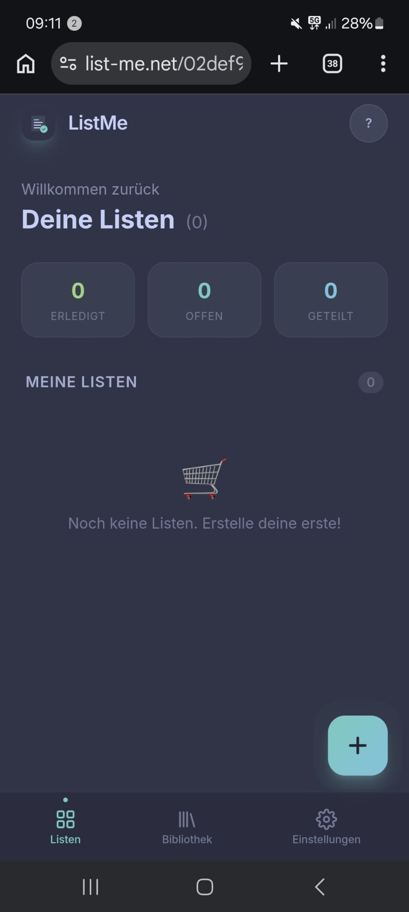

Your data lives on your device first. The server is only involved when you share a list or sync across devices.

---

## 2. Navigation

The bottom navigation bar has three tabs:

| Icon | Tab               | What's here                           |
| ---- | ----------------- | ------------------------------------- |
| ☰   | **Listen**        | Your shopping lists (home screen)     |
| 📚   | **Bibliothek**    | Saved templates and your item history |
| ⚙️   | **Einstellungen** | Profile, appearance, watch pairing    |

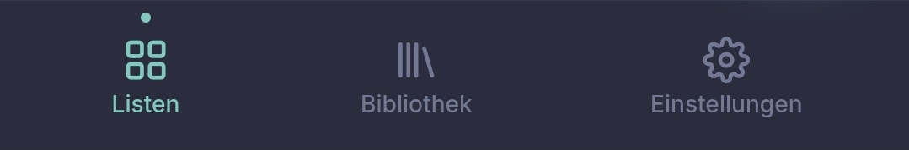

Tapping the back button or swiping right from a list returns to the home screen.

---

## 3. Your Lists (Listen)

The home screen is divided into two sections:

- **Meine Listen** — lists you created on this device
- **Geteilt mit mir** — lists shared with you by another device

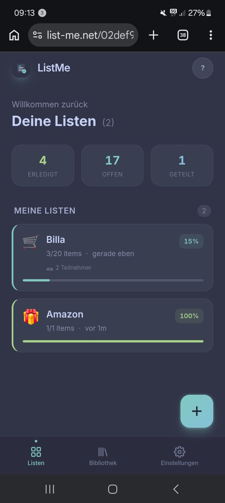

Each list card shows:

- **Emoji** and **name**
- **Progress bar** — how many items are checked vs. total
- **Participant avatars** — shown when more than one device has access to the list
- **Accent colour** — each list gets a unique colour for quick identification

At the top of the screen, quick stats show the total number of open items across all lists.

---

## 4. Creating a List

Tap the **+** button (bottom right) to open the "Neue Liste" sheet.

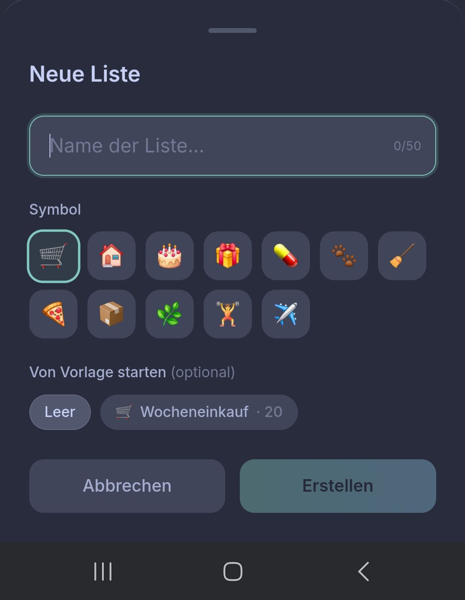

**Steps:**

1. Tap an emoji from the picker (or search for one)
2. Enter a list name in the text field
3. _(Optional)_ Tap **Von Vorlage starten** to pre-fill items from a saved template (see [Library](#11-library-bibliothek))
4. Tap **Erstellen**

The new list appears immediately at the top of "Meine Listen" and opens automatically.

---

## 5. List Detail View

Tap any list card to open it.

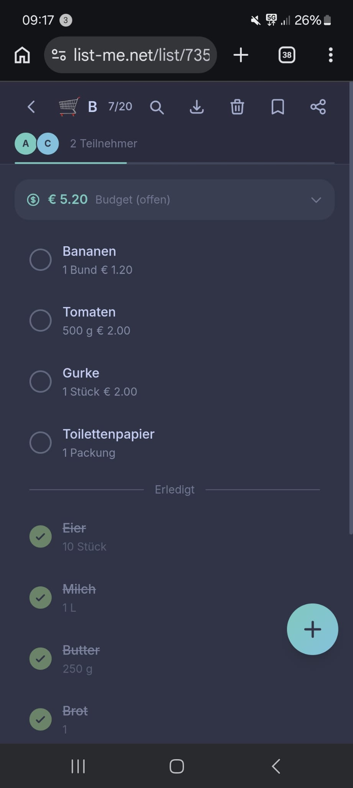

### Header area

| Element         | Action                                           |
| --------------- | ------------------------------------------------ |
| ← back arrow    | Return to home                                   |
| Progress chip   | Shows open item count; turns green when all done |
| 🔗 Share button | Generate a share link for this list              |
| ··· menu        | Export, save as template, move to trash          |

### Progress bar

A thin bar below the header fills from left to right as you check off items. Turns fully green when the list is complete.

### Budget bar

If any item has a price set, a budget bar appears showing the estimated total cost of unchecked items.

### Participant avatars

When two or more devices share a list, small circular avatars appear in the header. A green dot on an avatar means that device is currently viewing the list.

---

## 6. Adding Items

Tap the **+** FAB inside a list to open the "Artikel hinzufügen" sheet.

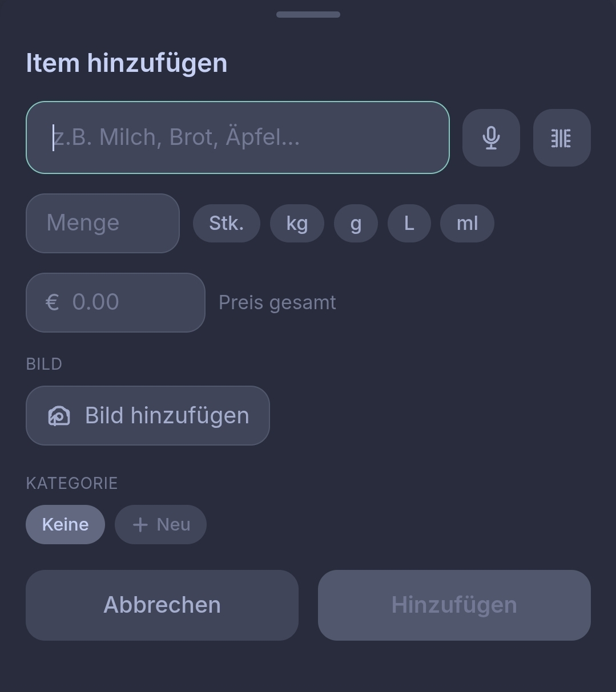

### Typing

Start typing the item name. Suggestions from your item history appear as chips below the input — tap one to fill all fields automatically (name, quantity, unit, price, image).

### Barcode scanner

Tap the **barcode icon** to open the camera scanner.

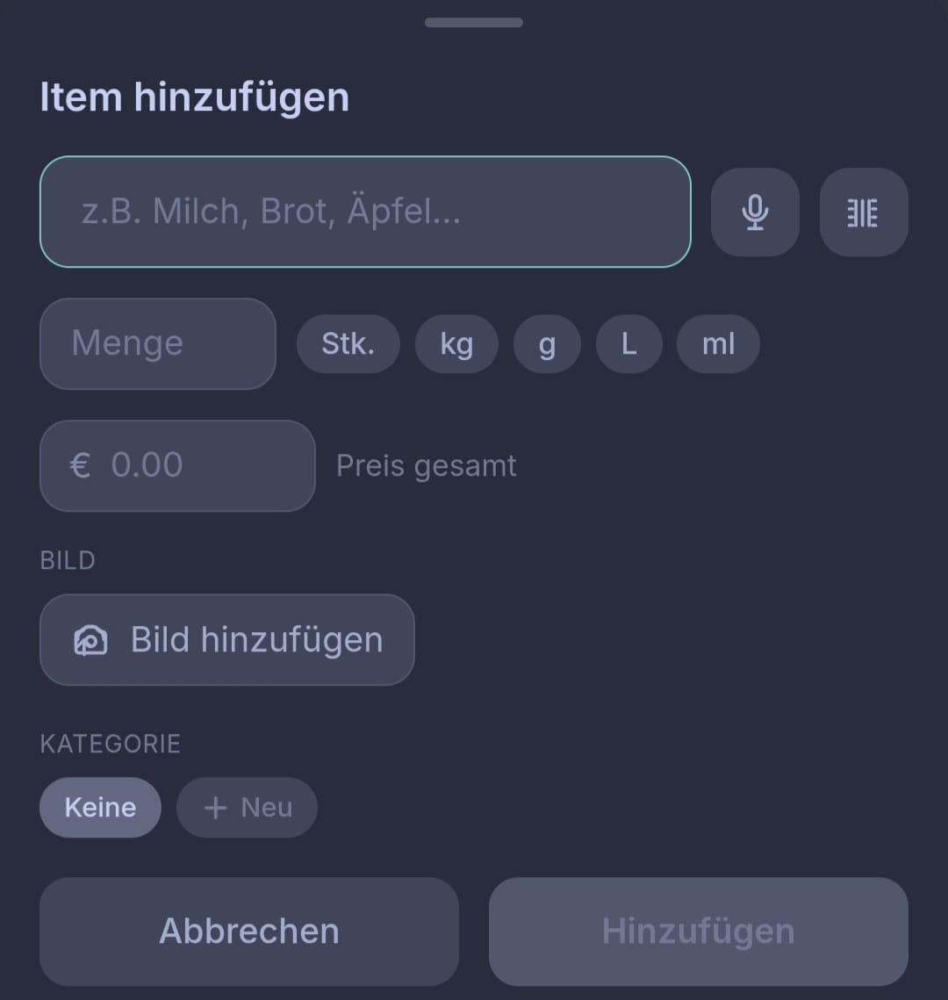

1. Point the camera at any EAN/UPC barcode
2. The product name and quantity are looked up automatically (OpenFoodFacts)
3. Confirm or cancel — the form is pre-filled with the product details

### Voice input

Tap the **microphone icon** and speak the item name. The recognised text fills the name field.

### From Library

Tap the **library icon** (books) to open the Bibliothek in picker mode. Browse your item history and tap any item to fill the form.

### Item fields

| Field     | Notes                                    |
| --------- | ---------------------------------------- |
| Name      | Required                                 |
| Menge     | Numeric quantity (e.g. 2)                |
| Einheit   | Unit (e.g. kg, Stk, ml)                  |
| Preis     | Price per item — used for the budget bar |
| Kategorie | Assign to a category for filtering       |
| Labels    | Colour tags for extra organisation       |

---

## 7. Checking Off Items

Tap any item row to toggle it between unchecked and checked.

- Checked items move to the bottom of the list automatically
- Checked items appear with strikethrough text in a muted colour
- Tap a checked item again to uncheck it — it moves back to the top

Changes sync to all devices sharing the list in real time (when online).

---

## 8. Search & Filter

### Search

Tap the **search icon** in the list header to expand the search bar.

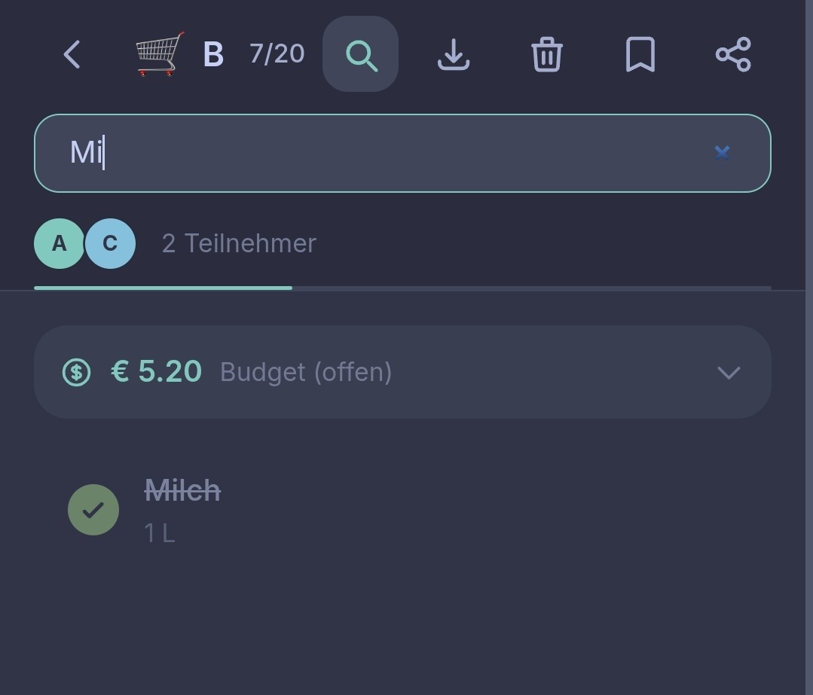

Type to filter items by name. The filter applies instantly.

### Category filter chips

Horizontal scrollable chips appear below the header for each category present in the list.

Tap a category chip to show only items in that category. Tap **Alle** to clear the filter.

---

## 9. Sharing a List

Tap the **share icon** (🔗) in the list header.

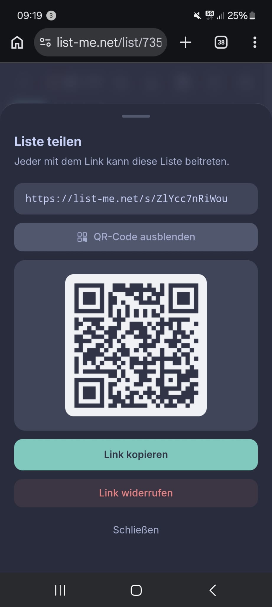

A unique share link is generated. Anyone who opens this link gets the list added to their device and joins as a participant.

**Share options:**

- **Link kopieren** — copies the link to clipboard for pasting into any message app
- **QR-Code** — shows a scannable QR code (useful when handing your phone to someone)

The shared list syncs in real time between all devices that have joined.

---

## 10. Cross-Device Sync

To bring all your lists to a second device (e.g. a new phone), simply copy your sync URL and open it on the other device.

Every device has a unique sync URL — no setup required. Just copy it directly from the address bar and share it via any channel (message, email, QR code).

**On the new device:**

1. Open the sync URL in Chrome
2. A preview shows what will be imported: your lists, profile, templates, and theme
3. Tap **Alle Listen importieren**

After syncing, both devices share the same lists and stay in sync via the shared list mechanism.

---

## 11. Library (Bibliothek)

The Library tab stores two things: **templates** you've saved and **items** from your history.

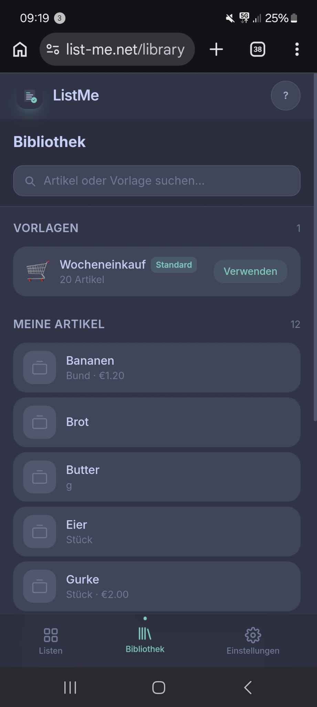

### Vorlagen (Templates)

Templates are pre-filled lists you can reuse. Tap a template to create a new list with all its items instantly.

- **Swipe left** on a template to delete it
- Tap **···** to rename or edit the items in a template
- Save the current list as a template from the list's **···** menu → **Als Vorlage speichern**

### Meine Artikel (Item History)

Every item you've ever added is saved here, deduplicated by name. Items are sorted by how often you use them.

- Tap an item to add it directly to the current list (if you came from a list) or to see its details
- **Swipe left** to remove an item from your history
- The search bar at the top filters both Vorlagen and Meine Artikel simultaneously

### Picker mode

Tap the **library icon** button inside the "Artikel hinzufügen" sheet to open the Library in picker mode. Selecting an item fills the form and returns you to the sheet.

---

## 12. Settings (Einstellungen)

### Profile

- Tap the avatar circle to upload a photo (camera or gallery)
- Enter your first and last name
- Tap **Speichern** — your name and photo appear to other participants in shared lists

### Darstellung (Appearance)

Toggle between **dark mode** (Catppuccin Frappe) and **light mode** (Catppuccin Latte). Your preference is saved locally.

### Smartwatch

Pair a Pixel Watch 3 with the app. See [Smartwatch](#13-smartwatch-pixel-watch-3) for the full pairing guide.

### App info

Shows the current version, active theme name, and confirms offline-first mode is active.

---

## 13. Smartwatch (Pixel Watch 3)

The ListMe watch app lets you view and check off items directly from your wrist — no phone required in the store.

### Requirements

- Pixel Watch 3 (Wear OS 4)
- ListMe watch app installed on the watch
- **Chrome** browser on your phone (for initial pairing)
- The app must be accessed over **HTTPS** or `localhost` for Bluetooth to work

### Installing the watch app

The watch app is a separate APK built from the `wearable/` folder of this project. Install it via Android Studio or ADB:

```bash
cd wearable
./gradlew installDebug
```

### Pairing (one-time setup)

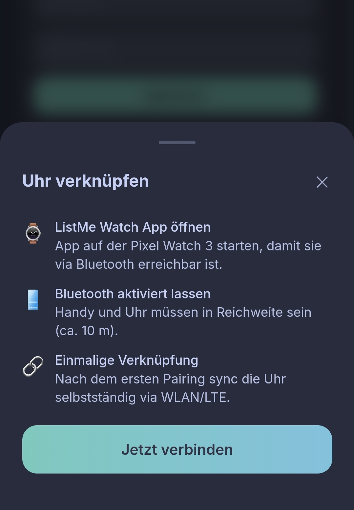

1. Open the **ListMe app** on the Pixel Watch 3 (it must be in the foreground)
2. On your phone, go to **Einstellungen → Smartwatch → Verbinden**
3. Tap **Jetzt verbinden** — Chrome shows a Bluetooth device picker

4. Select your Pixel Watch 3
5. The app sends your sync token to the watch via Bluetooth

After pairing, the watch downloads all your lists over WiFi or LTE automatically.

### Using the watch

**Navigating lists:**

- Scroll through the list using the crown or swipe
- Tap a list to open it
- Swipe right or press the back button to return

**Checking items:**

- Tap an item to toggle it checked/unchecked
- The checkbox turns green immediately (optimistic update)
- Checked items slide to the bottom
- The "x übrig" counter updates instantly

**Syncing:**

- Tap **Aktualisieren** at the bottom of the list screen to force a sync
- Changes made on the watch sync to the backend over WiFi/LTE
- Changes made on the phone appear on the watch after the next refresh

### Troubleshooting

| Problem                                | Solution                                                                             |
| -------------------------------------- | ------------------------------------------------------------------------------------ |
| "Jetzt verbinden" button is greyed out | Open the app in Chrome on HTTPS (not HTTP over local IP)                             |
| Bluetooth picker shows no devices      | Make sure the watch app is open in the foreground                                    |
| Watch shows error after pairing        | Check that the watch has WiFi or LTE. Tap "Nochmal versuchen".                       |
| Lists not updating                     | Tap "Aktualisieren" on the watch, or re-pair if the sync token has expired (30 days) |

---

## 14. Offline Use

ListMe is **offline-first** — all data is stored on your device and the app works fully without an internet connection.

**What works offline:**

- Viewing all lists and items
- Checking and unchecking items
- Adding new items
- Creating new lists

**What requires a connection:**

- Sharing a list with someone new
- Syncing changes to other devices
- Loading lists on the watch for the first time

When you come back online, all offline changes are automatically sent to the server and broadcast to other devices.

---

## 15. Trash & Restore

Deleted items are not immediately removed — they go to the list's trash.

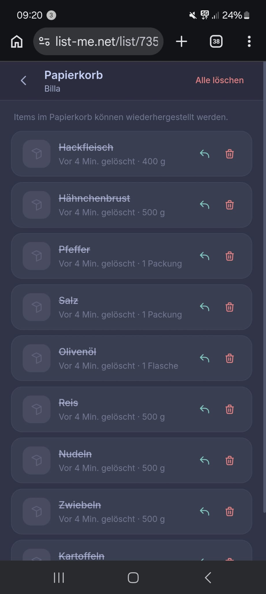

**Deleting an item:** Swipe left on any item row, then confirm.

**Viewing the trash:**

1. Open a list
2. Tap **···** in the header → **Papierkorb**

**Restoring an item:** Tap **Wiederherstellen** on any item in the trash. It returns to the list as unchecked.

Trash is per-list. Items in the trash do not count toward the progress bar or budget.

---

_For technical documentation see [architecture.md](architecture.md) and the individual ID-_.md files.\*
