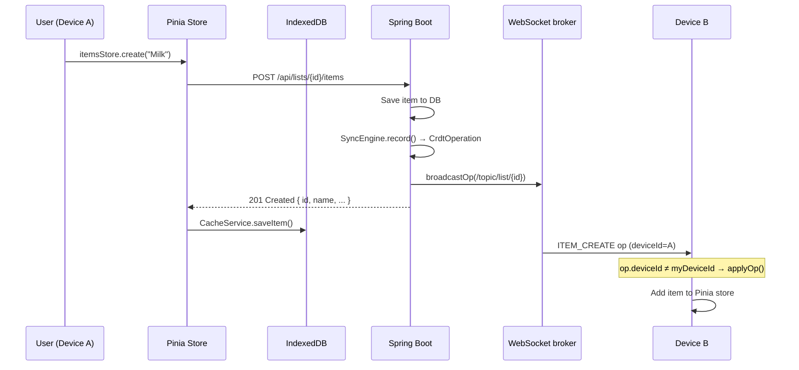
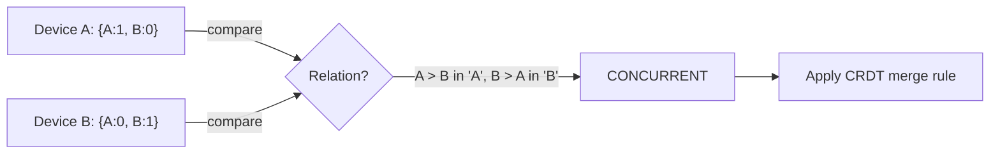

# ListMe — Architecture

> The three concepts in this document are the **mental model** the whole codebase is built around.
> Read this before touching any file.

---

## Table of Contents

1. [What Is This App?](#1-what-is-this-app)
2. [The Big Picture](#2-the-big-picture)
3. [Core Concepts](#3-core-concepts)
   - [3.1 Account-Free Device Identity](3.1_device_identity.md)
   - [3.2 Offline-First Architecture](3.2_offline_first.md)
   - [3.3 CRDTs — Conflict-Free Replication](3.3_crdts.md)
   - [3.4 Vector Clocks — Tracking Causality](3.4_vector_clocks.md)
   - [3.5 Real-Time Sync with WebSocket/STOMP](3.5_real_time_sync.md)
4. [User Stories Features](#4-user-stories-features)
   - **6. Sharing via Invite Code**
     - [6.1 Invite Code Generation](6.1_invite_code_generation.md)
     - [6.2 Joining Lists via Code](6.2_joining_lists.md)
     - [6.3 Permissions & Access Control](6.3_permissions_access_control.md)
   - **8. Item Management (Edit & Delete)**
     - [8.1 Item Editing](8.1_item_editing.md)
     - [8.2 Item Deletion](8.2_item_deletion.md)
     - [8.3 Real-Time Updates](8.3_real_time_updates.md)

---

## 1. What Is This App?

**ListMe** is a collaborative shopping list app that works fully offline and syncs automatically when internet is available. Think Google Docs for shopping lists — multiple people can edit the same list simultaneously, even without a connection, and changes merge together without conflicts.

The three-sentence architecture:

> Each device generates a random identity (no accounts). All mutations are stored as a log of operations using **CRDTs** (Conflict-free Replicated Data Types), keyed by **vector clocks** to track causality. The server is a **relay + backup** — it doesn't own the truth, every device does.

---

## 2. The Big Picture

```
┌─────────────────────────────────────────────────────────────────────┐
│                        USER'S DEVICES                               │
│                                                                     │
│  ┌─────────────────────┐       ┌─────────────────────┐             │
│  │   Browser / PWA     │       │   Browser / PWA     │             │
│  │                     │       │                     │             │
│  │  Vue 3 + Pinia      │       │  Vue 3 + Pinia      │             │
│  │  ┌───────────────┐  │       │  ┌───────────────┐  │             │
│  │  │  IndexedDB    │  │       │  │  IndexedDB    │  │             │
│  │  │ (Dexie)       │  │       │  │ (Dexie)       │  │             │
│  │  │  · lists      │  │       │  │  · lists      │  │             │
│  │  │  · items      │  │       │  │  · items      │  │             │
│  │  │  · op queue   │  │       │  │  · op queue   │  │             │
│  │  └───────────────┘  │       │  └───────────────┘  │             │
│  └────────┬────────────┘       └────────┬────────────┘             │
│           │  HTTP + WebSocket            │  HTTP + WebSocket        │
└───────────┼──────────────────────────────┼──────────────────────────┘
            │                              │
            ▼                              ▼
┌───────────────────────────────────────────────────────┐
│                   Spring Boot Backend                 │
│                                                       │
│  REST Controllers   WebSocket (STOMP)                 │
│  ┌────────────┐    ┌─────────────────────────────┐    │
│  │ ListCtrl   │    │ /topic/list/{id}            │    │
│  │ ItemCtrl   │    │ /topic/list/{id}/presence   │    │
│  │ ShareCtrl  │    │ /app/list/{id}/join         │    │
│  │ SyncCtrl   │    │ /app/list/{id}/leave        │    │
│  └─────┬──────┘    └──────────────┬──────────────┘    │
│        │                          │                    │
│  ┌─────▼──────────────────────────▼──────────────┐    │
│  │              SyncEngine (CRDT core)           │    │
│  │  · record() — snapshot vector clock + persist │    │
│  │  · applyIncoming() — idempotent merge         │    │
│  │  · getOperationsSince() — pull catchup        │    │
│  └─────────────────────┬─────────────────────────┘    │
│                        │                               │
└────────────────────────┼───────────────────────────────┘
                         │
                         ▼
             ┌───────────────────────┐
             │    PostgreSQL 16      │
             │                      │
             │  devices             │
             │  lists               │
             │  items               │
             │  list_devices        │
             │  vector_clocks       │
             │  crdt_operations     │
             │  sync_tokens         │
             └───────────────────────┘
```

### How data flows end-to-end



---

## 3. Core Concepts

### 3.1 Account-Free Device Identity

**There are no user accounts, no login, no passwords.**

On first load, the frontend generates a random UUID using `crypto.randomUUID()` and stores it in IndexedDB forever. This UUID is the device's permanent identity.

```
Browser opens for first time
        │
        ▼
getDeviceId() checks IndexedDB
        │
  not found ──► generate crypto.randomUUID()
        │              └─► store in IndexedDB
  found ◄───────────────────────────────────┘
        │
        ▼
Every HTTP request: X-Device-Id: <uuid>
Every WebSocket:    ?deviceId=<uuid>
```

**Backend side** (`DeviceArgumentResolver.java`): The `@CurrentDevice` annotation on every controller method reads the `X-Device-Id` header and auto-creates a `Device` row in the DB if it doesn't exist yet. No registration endpoint needed.

**Why this matters for the CRDT:** The device UUID is the key in every vector clock. `{deviceA: 5, deviceB: 3}` means "device A has made 5 operations, device B has made 3 operations that we know about."

**Sharing a list:**

1. User taps "Share" → `POST /api/lists/{id}/share` → server generates a 12-character random token
2. Share link: `listme.app/s/Xk9mP2`
3. Another device opens it → `POST /api/share/{token}/join` → that device is added to `list_devices`
4. Both devices now sync in real-time via WebSocket

**Cross-device sync (same person, multiple devices):**

1. `POST /api/sync` → groups all your lists under a 24-character sync token
2. Open on new device → `POST /api/sync/{token}/apply` → all lists transferred

> **Source:** The account-free model is consistent with the "local-first software" philosophy articulated by Kleppmann et al. (2019): _"In local-first software, the availability of another user's computer does not limit what you can do on your own computer."_ [^1]

---

### 3.2 Offline-First Architecture

**Rule:** The app must be fully usable with zero network connectivity. The server is a sync mechanism, not a requirement.

We achieve this in four layers:

| Layer          | Mechanism                                             | Files                                       |
| -------------- | ----------------------------------------------------- | ------------------------------------------- |
| **App shell**  | Service Worker (Workbox) caches all JS/CSS/HTML       | `vite.config.ts` → VitePWA                  |
| **Read data**  | IndexedDB (Dexie) serves cached lists/items instantly | `services/cache.ts`, `services/db.ts`       |
| **Write data** | Mutations apply locally + enqueue CRDT op             | `stores/items.ts`, `crdt/OperationQueue.ts` |
| **Reconnect**  | `useSyncQueue` flushes queue on `online` event        | `composables/useSyncQueue.ts`               |

#### The offline write path

```
User adds item while offline
         │
         ▼
itemsStore.create() → HTTP POST → network error
         │
   isNetworkError? ──► No ──► re-throw (server error, don't swallow)
         │
        Yes
         │
         ▼
1. Generate itemId = crypto.randomUUID()       ← client owns the ID
2. Build Item object with that ID
3. Push to Pinia store  ← UI updates instantly
4. CacheService.saveItem()  ← survives page refresh
5. LocalClockService.getNextClock()  ← increment per-list counter
6. OperationQueue.enqueue(ITEM_CREATE op)  ← persisted to IndexedDB
         │
         ▼
         (time passes, connectivity returns)
         │
         ▼
isOnline watcher fires → useSyncQueue.flushQueue()
         │
         ▼
POST /api/lists/{id}/crdt/ops  [{ id, operationType, payload, vectorClock }]
         │
         ▼
SyncEngine.applyIncoming()  ← idempotent, uses op UUID as dedup key
         │
         ▼
itemsStore.fetchAll()  ← reconcile local state with server truth
```

**Key design decision:** Offline creates use a client-generated UUID as the item ID. The backend's `applyIncoming()` case for `ITEM_CREATE` creates the item with `item.setId(UUID.fromString(itemId))` — the server respects the client's ID. This prevents duplicates and makes the queue flush idempotent.

> **Source:** Shapiro et al. (2011) describe this as the essential property: _"the system can continue to be used while disconnected from the network, and [...] any two replicas that have received the same set of updates are in the same state."_ [^2]

---

### 3.3 CRDTs — Conflict-Free Replication

**The problem:** Alice unchecks "Milk" while offline. Bob renames "Milk" to "Organic Milk" while offline. They reconnect. Whose change wins?

**The answer:** Both. CRDTs define merge rules so that any order of applying operations produces the same final state. This property is called **strong eventual consistency (SEC).**

> _"A CRDT is a data structure [...] where replicas can be updated independently and concurrently without coordination, and where it is always mathematically possible to resolve inconsistencies that might result."_ — Shapiro et al. [^2]

#### CRDT types used in ListMe

| Type                                | Used for                                   | Merge rule                                    |
| ----------------------------------- | ------------------------------------------ | --------------------------------------------- |
| **LWW-Register** (Last-Write-Wins)  | Item name, checked status, list name/emoji | Highest timestamp wins; tie-break by deviceId |
| **RGA** (Replicated Growable Array) | Item ordering (planned)                    | Concurrent inserts ordered by element ID      |
| **OR-Set** (Observed-Remove Set)    | List participants                          | Add wins over concurrent remove               |
| **PN-Counter**                      | Likes/votes (planned)                      | Sum of positive and negative counters         |

#### How it's implemented

Every mutation creates a `CrdtOperation` record:

```json
{
  "id": "550e8400-e29b-41d4-a716-446655440000",
  "listId": "...",
  "deviceId": "...",
  "operationType": "ITEM_UPDATE",
  "payload": {
    "itemId": "...",
    "name": "Organic Milk",
    "timestamp": 1709042400000
  },
  "vectorClock": { "device-A": 3, "device-B": 1 },
  "createdAt": "2026-02-26T10:00:00Z"
}
```

The `crdt_operations` table is an **append-only log** — operations are never deleted (only pruned after a retention period). This log is the ground truth. The `items` table is a materialised view derived from applying the log.

**LWW resolution in `SyncEngine.applyEffect()`:**

```java
case "ITEM_UPDATE" -> {
    // LWW: only update if incoming timestamp is newer
    long incomingTs = toLong(payload.get("timestamp"));
    long localTs = item.getUpdatedAt().toEpochMilli();
    if (incomingTs >= localTs) {
        item.setName(name);
        itemRepository.save(item);
    }
}
```

Both Alice's rename and Bob's concurrent edit get stored in the operation log. The one with the higher timestamp wins in the materialised `items` table. Neither operation is lost — they're both in the log for audit and conflict UI.

---

### 3.4 Vector Clocks — Tracking Causality

**The problem:** Timestamps alone are unreliable across distributed devices (clocks drift, users travel time zones). We need a way to know whether operation A _caused_ operation B, or whether they happened _concurrently_ and might conflict.

**Solution:** Vector clocks, introduced by Fidge (1988) and independently by Mattern (1989). [^3][^4]

A vector clock is a map of `{ deviceId → counter }`. Every device maintains its own counter per list and increments it on every write.

```
Initial state:  { A: 0, B: 0 }

Device A creates item:    { A: 1, B: 0 }   ← A's op #1
Device B renames item:    { A: 0, B: 1 }   ← B's op #1

Are these concurrent?
  A's clock: { A: 1, B: 0 }
  B's clock: { A: 0, B: 1 }
  A has greater A, B has greater B → CONCURRENT → CRDT merge needed ✓
```

The comparison logic (identical in both Java and TypeScript):

```
EQUAL      → clocks are identical
BEFORE     → this.every(d => this[d] ≤ other[d]) && exists d: this[d] < other[d]
AFTER      → reverse of BEFORE
CONCURRENT → neither dominates (both have at least one greater counter)
```



**In practice:** Vector clocks **detect** conflicts. CRDTs **resolve** them. They work together:

1. `SyncEngine.record()` snapshots the current vector clock and stores it with each op
2. `ConflictDetector.detectConflicts()` finds pairs of ops on the same item that are CONCURRENT
3. The merge strategy (LWW, OR-Set, etc.) determines the final state

> _"Vector clocks allow us to detect when events are concurrent [...] and therefore may need to be reconciled."_ — Kleppmann, _Designing Data-Intensive Applications_ (2017) [^5]

---

### 3.5 Real-Time Sync with WebSocket/STOMP

When two devices are online simultaneously, changes propagate in sub-second time via WebSocket.

**Protocol:** STOMP (Simple Text Oriented Messaging Protocol) over WebSocket. STOMP adds a pub/sub layer on top of raw WebSocket — clients subscribe to _topics_ and the server broadcasts to all subscribers. [^6]

**Topic layout:**

| Topic                           | Direction        | Payload                 |
| ------------------------------- | ---------------- | ----------------------- |
| `/topic/list/{listId}`          | Server → clients | `CrdtOperationResponse` |
| `/topic/list/{listId}/presence` | Server → clients | `PresenceMessage`       |
| `/app/list/{listId}/join`       | Client → server  | (empty)                 |
| `/app/list/{listId}/leave`      | Client → server  | (empty)                 |

**Connection flow:**

```
ListDetailView mounts
       │
       ▼
useListSync.startSync(listId)
       │
       ▼
connectWebSocket()    ← idempotent, uses STOMP.js Client
       │
       ├── subscribe /topic/list/{listId}           ← CRDT ops
       └── subscribe /topic/list/{listId}/presence  ← who's online
       │
       ▼
send /app/list/{listId}/join    ← announce presence
```

**The deduplication rule:** Every `CrdtOperationResponse` contains the `deviceId` that created it. On the receiving side:

```typescript
// useListSync.ts
if (op.deviceId === myDeviceId) return; // skip own broadcasts
applyOp(listId, op, itemsStore);
```

This prevents the double-add bug where your own item appears twice (once from the HTTP response that already updated the store, and again from the WebSocket broadcast). [^7]

**Presence tracking:** The server holds an in-memory `PresenceTracker` (a `ConcurrentHashMap<UUID, Set<String>>`). When a WebSocket session disconnects, the `SessionDisconnectEvent` listener removes the device from all tracked lists. This is kept in-memory on purpose — presence is ephemeral and doesn't need to survive a server restart.

---

## References

[^1]: Kleppmann, M., Wiggins, A., van Hardenberg, P., & McGranaghan, M. (2019). **Local-first software: you own your data, in spite of the cloud.** _Proceedings of the 2019 ACM SIGPLAN International Symposium on New Ideas, New Paradigms, and Reflections on Programming and Software_, pp. 154–178. https://doi.org/10.1145/3359591.3359737

[^2]: Shapiro, M., Preguiça, N., Baquero, C., & Zawirski, M. (2011). **A comprehensive study of Convergent and Commutative Replicated Data Types.** _INRIA Technical Report RR-7506_. https://hal.inria.fr/inria-00555588

[^3]: Fidge, C. (1988). **Timestamps in message-passing systems that preserve the partial ordering.** _Proceedings of the 11th Australian Computer Science Conference_, 10(1), 56–66.

[^4]: Mattern, F. (1989). **Virtual time and global states of distributed systems.** _Parallel and Distributed Algorithms_, pp. 215–226.

[^5]: Kleppmann, M. (2017). **Designing Data-Intensive Applications** (1st ed.). O'Reilly Media. ISBN 978-1-4919-0313-1.

[^6]: Brodwall, J., & Stomp Community. (2012). **STOMP Protocol Specification 1.2.** https://stomp.github.io/stomp-specification-1.2.html

[^7]: The double-add race condition fixed in `useListSync.ts` — see Kleppmann (2017), Chapter 5, §"Reading Your Own Writes."
